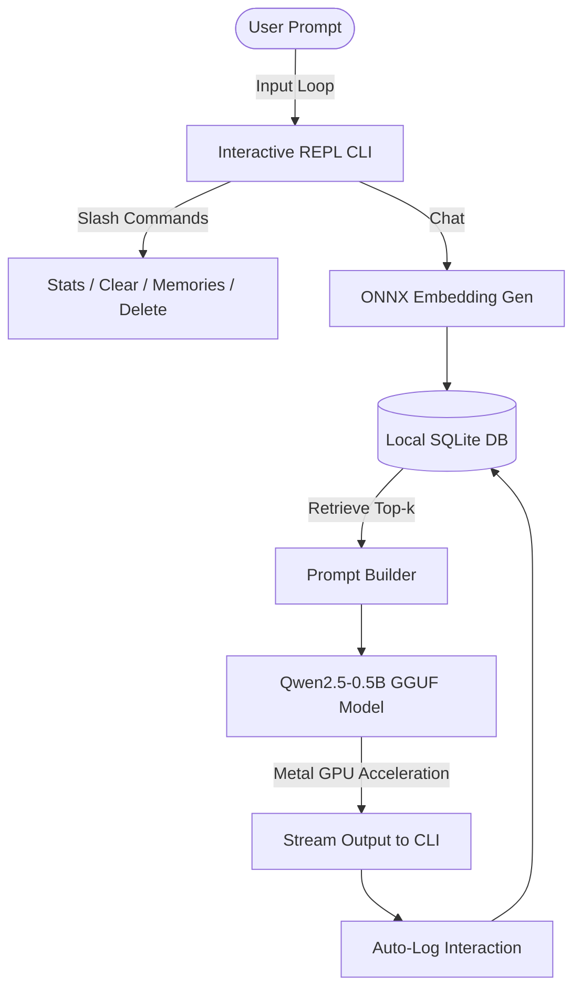

# Edge AI Assistant (M4 Apple Silicon Optimized)

A high-performance, fully on-device AI assistant designed to run 100% offline on Apple Silicon (M1/M2/M3/M4) under a **1 GB RAM ceiling**. 

The system implements a local Retrieval-Augmented Generation (RAG) loop combining a quantized small language model with an in-process semantic memory database.



## Key Features

*   **Offline LLM Generation**: Runs `Qwen2.5-0.5B-Instruct` in 4-bit quantization (GGUF) using `llama-cpp-python` with full Metal GPU acceleration.
*   **ONNX Semantic Memory**: Generates local text embeddings using `all-MiniLM-L6-v2` compiled to ONNX via `onnxruntime`, indexing and retrieving context from an in-process SQLite database.
*   **Extremely Low Resource Footprint**: The entire execution stack (embedder + database + LLM + application) operates under **~850 MB of RAM** at peak load.
*   **Real-time Performance Telemetry**: Built-in interactive slash commands monitor process memory, database records, embedding search latency, TTFT, and token-generation speed.

---

## Installation & Setup

### 1. Prerequisites
Ensure you have Xcode Command Line Tools installed (for compilation of C++ libraries):
```bash
xcode-select --install
```

### 2. Setup Virtual Environment & Dependencies
Use the `CMAKE_ARGS` flag during installation to ensure `llama-cpp-python` compiles with **Metal support** enabled:
```bash
# Create and activate virtual environment
python3 -m venv venv
source venv/bin/activate

# Install dependencies with Metal acceleration
CMAKE_ARGS="-DGGML_METAL=on" pip install -r requirements.txt
```

### 3. Initialize & Download Models
Run the setup script to pull the quantized LLM model and embedding binaries directly from Hugging Face:
```bash
python setup.py
```

---

## Usage Guide

Launch the interactive assistant in your terminal:
```bash
python main.py
```

### Interactive Commands (Slash Commands)
Type these directly into the `You:` prompt to inspect or manipulate the system state:
*   `/stats` - Shows active process RAM footprint, embedding search latency, generation speed (tokens/sec), and SQLite record count.
*   `/memories` - Lists all stored memories in SQLite with database IDs and timestamps.
*   `/delete <id>` - Deletes a specific memory entry by ID.
*   `/clear` - Wipes all memories from the local database.
*   `/system [new prompt]` - Prints or dynamically updates the LLM system persona.
*   `/help` - Prints the command directory.
*   `/exit` or `/quit` - Closes the assistant.

---

## Benchmarking & Performance (M4 Apple Silicon)

To run a series of automated performance tests measuring startup footprint, embedding speeds, and generation throughput, execute:
```bash
python benchmark.py
```
This will generate a detailed markdown report inside `docs/benchmarks.md`.

### Summary of Performance:
*   **Cold Start Latency**: Memory store initializes in **0.15s**; LLM engine loads in **0.30s**.
*   **Time-to-First-Token (TTFT)**: **~29ms** (Metal GPU prefill).
*   **Throughput (Generation)**: **~114 tokens/second**.
*   **Vector Search Latency**: **~1.2ms** (NumPy dot-product similarity over 50+ entries).
*   **Memory Footprint**: **~815 MB** peak RAM usage.

For a deep dive into design tradeoffs, engine selection, and system math, see the [Architecture & Design Whitepaper](docs/architecture.md).
