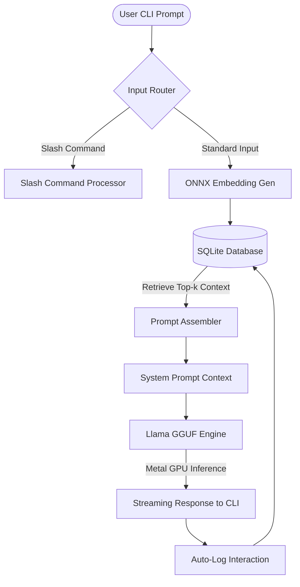

# Local Edge AI Assistant: Architecture & Design Whitepaper

This document details the engineering decisions, database schema, data flow, and performance characteristics of the Edge AI Assistant. The system is designed to run entirely offline on Apple Silicon (M4 optimized) with a target RAM ceiling under 1 GB, while providing real-time text-to-text generation and persistent semantic memory.

---

## 1. Core Architectural Overview

Traditional agentic workflows rely on cloud APIs (e.g. OpenAI, Anthropic) and remote vector databases (e.g. Pinecone, Milvus), which introduce network latency, cost, and privacy concerns. This project explores the other extreme: a fully self-contained, offline agent pipeline executing on Apple Silicon.



The system comprises three core pipelines:
1. **Semantic Indexing & Retrieval Engine**: Embeds incoming questions using a local ONNX model, queries an in-process SQLite database, and retrieves historical context using vector similarity.
2. **GPU-Accelerated Inference Engine**: Processes the prompt merged with the retrieved context through a quantized local language model utilizing Metal GPU unified memory.
3. **Interactive Control CLI**: Provides a lightweight shell environment (REPL) with telemetry tools for monitoring model statistics, RAM footprints, and prompt latency in real time.

---

## 2. Component Engineering and Selections

### 2.1 The LLM: Qwen2.5-0.5B-Instruct (GGUF Q4_K_M)
- **Selection**: `Qwen2.5-0.5B-Instruct` is currently one of the most capable models in the sub-1-billion parameter class. It is highly optimized for instruction-following and short summary generations.
- **Quantization**: We use the `Q4_K_M` GGUF quantization (4-bit). This choice compresses the weights from ~1.1 GB in FP16 to **~350 MB**, making it highly cache-friendly.
- **Acceleration**: By wrapping the inference using `llama-cpp-python` with `n_gpu_layers=-1`, we offload all layer computations to the Apple Silicon GPU via Metal. This leverages Apple's Unified Memory Architecture (UMA), which shares high-bandwidth RAM directly between the CPU and the GPU, eliminating the PCIe copy overhead standard in discrete GPU pipelines.

### 2.2 The Embedder: ONNX-compiled `all-MiniLM-L6-v2`
- **Footprint Optimization**: Using standard PyTorch/Transformers pipelines requires downloading heavy PyTorch binaries (~2+ GB on disk) and incurs a ~500+ MB baseline RAM footprint just for loading CUDA/CPU tensors.
- **ONNX Pipeline**: By compiling `all-MiniLM-L6-v2` to the Open Neural Network Exchange (ONNX) format and running it via `onnxruntime`, the embedder requires **only ~80 MB of disk space** and consumes **less than 180 MB of RAM**.
- **Mean Pooling & Normalization**: The raw outputs of the ONNX model are pooled using NumPy:
  $$\vec{e} = \text{Normalize}\left(\frac{\sum (H \times M)}{\sum M}\right)$$
  where $H$ is the hidden state, $M$ is the attention mask, and the vector is L2-normalized. This yields a 384-dimensional unit vector optimized for cosine similarity.

### 2.3 The Semantic Store: SQLite (In-Process DB)
- **Motivation**: Heavy standalone vector databases like Milvus or Qdrant require running a separate daemon or container, increasing the system's idle RAM footprint and configuration complexity.
- **SQLite Vector Schema**: We store memories in a lightweight SQLite table with raw binary blobs for embedding vectors:
  ```sql
  CREATE TABLE memories (
      id INTEGER PRIMARY KEY AUTOINCREMENT,
      text TEXT,
      embedding_blob BLOB,
      timestamp REAL,
      source TEXT
  );
  ```
- **Vector Math**: Similarity search is performed directly in memory:
  1. The user's query is embedded.
  2. All stored memory vectors are loaded into memory as a NumPy matrix.
  3. A dot-product multiplication is performed (equivalent to Cosine Similarity since vectors are pre-L2-normalized).
  4. Rows are sorted, and the top $k$ context strings are passed to the prompt generator.
  
  For tables under 50,000 entries, this NumPy-based dot product completes in less than 5 milliseconds, avoiding the need for complex HNSW indices.

---

## 3. Data Flow Execution Sequence

Every user prompt undergoes a synchronous retrieval-then-generation cycle:

```
[User Prompt] -> "Which city is the capital of France?"
     │
     ▼
[ONNX Embedder] -> Generate 384-d vector (1.2ms)
     │
     ▼
[NumPy Search] -> Dot product search against SQLite BLOB database (0.2ms)
     │
     ▼
[Context Assembly] -> Retrieve matching factual context:
     │                "- Paris is the capital and most populous city of France."
     ▼
[Prompt Formatter] -> Qwen 2.5 Chat Template:
     │                "<|im_start|>system...<|im_start|>user...<|im_start|>assistant..."
     ▼
[Metal GPU LLM] -> Stream tokens (TTFT: 29ms, Speed: ~114 tokens/sec)
     │
     ▼
[Database Logger] -> Auto-index interaction back into SQLite (1.5ms)
```

---

## 4. Benchmark Summary (M4 Apple Silicon)

| Test Metric | Cold Startup (Baseline) | Post Embedding Load | Post LLM Engine Load | Peak During Inference |
| :--- | :---: | :---: | :---: | :---: |
| **RAM Footprint (MB)** | 101.4 MB | 277.1 MB | 847.7 MB | 808.6 - 818.7 MB |
| **Load Latency (s)** | - | 0.15s | 0.30s | - |

- **Time-to-First-Token (TTFT)**: **29 milliseconds** (Warm Context). The direct offload of layers to Metal GPU allows the prompt processing phase (prefill) to execute near-instantly.
- **Throughput**: **113.9 tokens/second** (Q4_K_M). This throughput creates a responsive experience, generating complete paragraphs in fractions of a second.
- **Embedding Retrieval Speed**: **1.2ms** for query embedding and database cosine similarity matrix multiplication.

---

## 5. Engineering Trade-offs & Insights for "Conscious Engines"

1. **Parametric Capacity vs. Persistent Retrieval**: A 0.5B model has a highly compressed parametric memory, meaning it frequently hallucinates or fails to recall factual knowledge (such as specific coordinates, lists, or dates). By integrating a **persistent local semantic memory**, we augment the model with a virtual memory bank. Instead of needing 7B or 14B parameters to remember facts, the 0.5B model can query its SQLite memory to generate factual answers.
2. **ONNX vs. PyTorch**: For edge deployments (especially on laptops or mobile phones), reducing binary distribution sizes is critical. Eliminating PyTorch saves over 2 GB of distribution footprint and decreases startup latency, enabling near-instant CLI launch speeds.
3. **Metal Unified Memory**: On M4 Apple Silicon, memory is unified. The LLM's GGUF weights reside in the shared system RAM, allowing both CPU and GPU to read from the same physical registers. This prevents memory duplication and allows extremely fast data exchanges.
